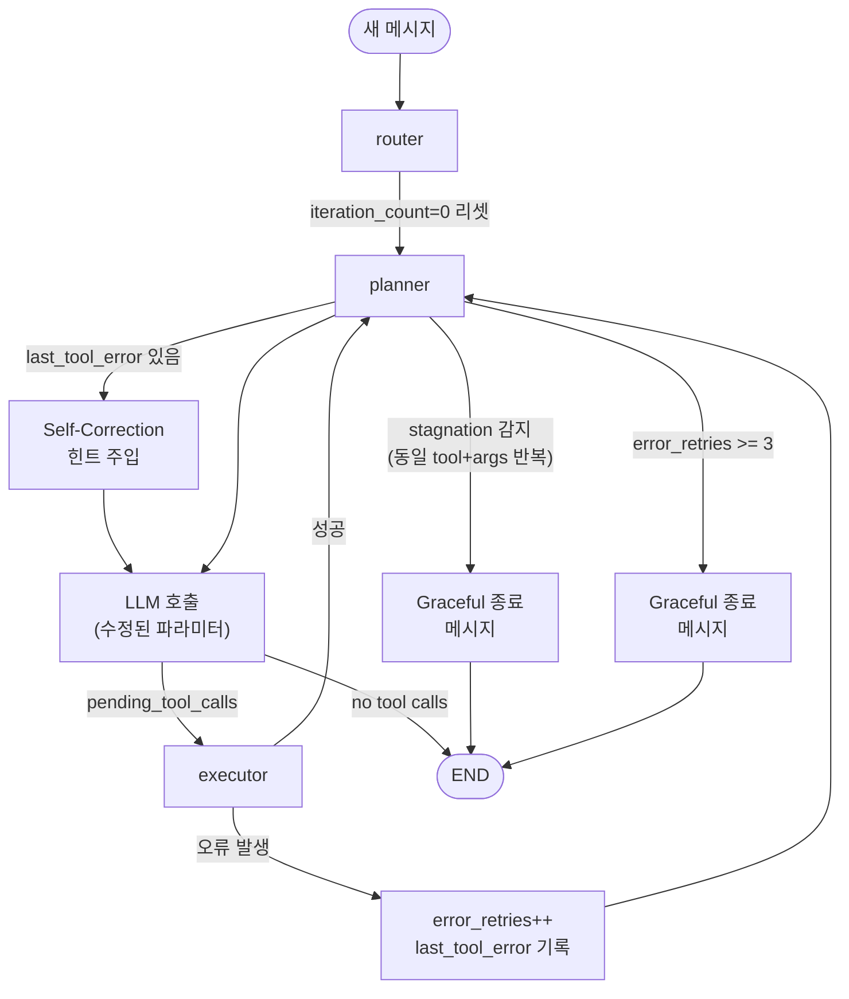

# Agent 개선 3종 + 로깅 시스템 구현 계획

## 현재 구조 분석 (실현 가능성 근거)

```
router → planner ──[pending_tool_calls?]──► executor ──► planner (루프백)
                  └─ final_answer ──► END
```

- executor → planner 루프백이 **이미 존재**하므로 Self-Correction은 구조 변경 없이 구현 가능
- `route_after_planner`에 MAX_ITERATIONS 코드가 **주석 처리된 채 존재** (해제만 하면 됨)
- `AgentState`는 TypedDict라 필드 추가 간단

---

## A. Self-Correction 루프

**변경 파일:** `[graph/state.py](graph/state.py)`, `[graph/nodes.py](graph/nodes.py)`

### 1. `AgentState`에 필드 추가

```python
# graph/state.py
error_retries: int       # 오류 재시도 횟수 (MAX_RETRIES 초과 시 중단)
last_tool_error: str     # 마지막 오류 메시지 (planner가 읽어 재시도 유도)
```

### 2. `executor_node` 수정

오류 발생 시 `[오류]` 문자열 대신 구조화된 오류 메시지 + state 업데이트:

```python
except Exception as e:
    error_msg = f"[TOOL_ERROR] tool={tool_name} | error={type(e).__name__}: {e} | 파라미터를 수정하여 재시도하세요."
    content = error_msg
    error_occurred = True  # 플래그

# 반환 시
return {
    ...,
    "error_retries": state.get("error_retries", 0) + (1 if error_occurred else 0),
    "last_tool_error": error_msg if error_occurred else "",
}
```

### 3. `planner_node` 수정 — 오류 컨텍스트 주입

```python
# planner_node 상단
if state.get("last_tool_error"):
    # messages 앞에 SystemMessage 형태로 오류 컨텍스트 주입
    correction_hint = SystemMessage(
        content=f"[Self-Correction 지시] 이전 도구 호출에서 오류가 발생했습니다: {state['last_tool_error']}\n"
                "파라미터를 수정하거나 다른 도구를 사용하여 재시도하세요. 절대 같은 파라미터를 반복하지 마세요."
    )
    messages_to_send = [correction_hint] + state["messages"]
else:
    messages_to_send = state["messages"]
```

`MAX_RETRIES = 3` 초과 시 planner가 graceful 메시지 반환 (C번과 통합).

---

## B. 구조화된 Planning 데이터

**변경 파일:** `[graph/state.py](graph/state.py)`, `[graph/nodes.py](graph/nodes.py)`, `[app.py](app.py)`

### 1. `AgentState`에 필드 추가

```python
current_plan: list   # [{"step": 1, "action": "기관코드 조회", "tool": "search_institution_code"}, ...]
```

### 2. `planner_node` 수정 — tool_calls → 구조화된 리스트 생성

기존 `plan` (단순 문자열) 유지하면서 `current_plan` 리스트 추가로 생성:

```python
current_plan = [
    {
        "step": i + 1,
        "tool": tc["name"],
        "args": tc["args"],
        "description": _tool_description(tc["name"]),  # 도구명 → 한글 설명 간단 매핑
    }
    for i, tc in enumerate(pending)
]
return {
    ...,
    "current_plan": current_plan,
    "plan": plan,  # 기존 문자열도 유지 (app.py 호환)
}
```

### 3. `app.py` — plan_step.output에 구조화된 내용 표시

```python
# _stream_graph 내 planner 이벤트 처리
if node_output.get("current_plan"):
    plan_lines = [
        f"Step {p['step']}: {p['tool']}({json.dumps(p['args'], ensure_ascii=False)})"
        for p in node_output["current_plan"]
    ]
    plan_text = "\n".join(plan_lines)
    plan_info = {"plan": plan_text, "has_pending": True}
```

> 프론트엔드는 `current_plan` 리스트를 State에서 바로 읽어 렌더링 가능 (카드/스텝 UI).

---

## C. 가드레일 — Stagnation 감지 (정상 워크플로우 차단 없음)

**변경 파일:** `[graph/state.py](graph/state.py)`, `[graph/nodes.py](graph/nodes.py)`

### 왜 단순 MAX_ITERATIONS를 쓰면 안 되는가

`iteration_count`는 현재 대화 전체에서 **리셋 없이 누적**됨.
신청서 작성(3단계) × 2회 = 6회 → MAX_ITERATIONS=5이면 두 번째 신청부터 차단.
또한 `apply` 도메인은 Step1 → Step2 → Step3 루프 3회가 **정상 플로우**.

### 방식: 두 가지 조합

**① `router_node`에서 메시지당 iteration_count 리셋**

```python
# router_node 반환 시
return {
    "selected_tools": selected_tools,
    "iteration_count": 0,        # 새 메시지마다 카운터 초기화
    "last_plan_signature": "",   # stagnation 시그니처도 초기화
}
```

**② `planner_node`에서 Stagnation 감지**

"무한루프"의 본질 = 에이전트가 **동일한 tool + 동일한 args**를 반복 호출하는 것.
정상 다단계 워크플로는 매번 다른 tool 또는 다른 args를 호출함.

```python
# planner_node — stagnation 체크 헬퍼
def _plan_signature(tool_calls: list) -> str:
    return "|".join(
        f"{tc['name']}:{json.dumps(tc['args'], sort_keys=True)}"
        for tc in sorted(tool_calls, key=lambda x: x["name"])
    )

# planner_node 내 tool_calls 생성 후
current_sig = _plan_signature(pending)
if current_sig and current_sig == state.get("last_plan_signature", ""):
    # 완전히 동일한 호출이 연속 → stagnation
    graceful_msg = AIMessage(
        content="동일한 도구를 같은 파라미터로 반복 시도하고 있습니다. "
                "현재 분석으로는 처리가 어렵습니다. 질문을 구체화하거나 다른 방법을 안내드릴게요."
    )
    return {
        "messages": [graceful_msg],
        "pending_tool_calls": [],
        "plan": "",
        "iteration_count": current_iter,
        "last_plan_signature": "",
    }

return {
    ...,
    "last_plan_signature": current_sig,
}
```

**③ `route_after_planner` MAX_ITERATIONS 주석은 그대로 유지 (해제 안 함)**

단순 카운트 기반 차단 대신 stagnation 감지로 대체.
`graph/graph.py`는 **변경 없음**.

### Self-Correction 에러 루프는 별도 차단

에러 재시도 루프는 `error_retries >= MAX_RETRIES(3)` 체크로 별도 처리 (A항목).
stagnation 감지와 이중으로 작동함.

---

## D. 로깅 시스템

**변경 파일:** `[graph/nodes.py](graph/nodes.py)` (logging 설정 추가)

```python
import logging

logger = logging.getLogger("naru.agent")
# 각 노드 진입/종료 시:
logger.info("[Router] ▶ 진입 | 마지막 질문: %s", last_human[:80])
logger.info("[Router] ◀ 완료 | categories=%s | tools(%d)", categories, len(selected_tools))
logger.info("[Planner] ▶ 진입 | iteration=%d | messages=%d", current_iter, len(state["messages"]))
logger.info("[Planner] ◀ 완료 | pending_tools=%s | error_retries=%d", [tc["name"] for tc in pending], ...)
logger.info("[Executor] ▶ 진입 | tools=%s", [tc["name"] for tc in pending_tools])
logger.info("[Executor] ◀ 완료 | results=%s", results_summary)
```

`logging.basicConfig(level=logging.INFO, format="%(asctime)s %(message)s")` 앱 시작 시 설정.

---

## 변경 파일 요약

- `[graph/state.py](graph/state.py)` — `error_retries`, `last_tool_error`, `current_plan`, `last_plan_signature` 필드 추가
- `[graph/nodes.py](graph/nodes.py)` — planner Self-Correction 로직, current_plan 생성, stagnation 감지, router_node iteration_count 리셋, logging 추가
- `[graph/graph.py](graph/graph.py)` — **변경 없음** (MAX_ITERATIONS 주석 그대로 유지)
- `[app.py](app.py)` — current_plan 기반 plan_step.output 표시 개선

## 흐름 변화 다이어그램




