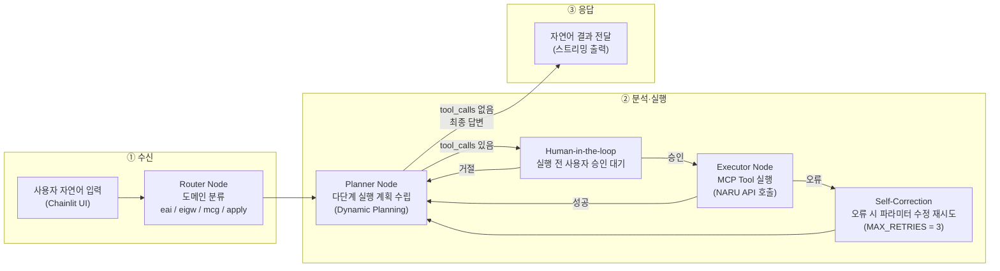

# NARU-Agent

## 개요

NARU 포털의 복잡한 메뉴 탐색과 조회 순서 암기를 없애기 위해,  
**생성형 AI 기반 대화형 에이전트**가 EAI·EIGW·MCG 모니터링 데이터를 자율 조회·분석하고,  
담당자에게 인사이트와 결과를 자연어로 즉시 전달합니다.

---

## 동작 흐름 (수신 → 분석·실행 → 응답)



---

## Point

### ① Semantic Router — 도메인 기반 Tool 자동 선별

- 사용자 질문을 `eai` / `eigw` / `mcg` / `apply` 도메인으로 분류
- 관련 도구만 LLM에 바인딩 → **LLM 컨텍스트 토큰 절감 + 응답속도 향상**
- 공통 도구(`search_institution_code`, `get_date_range`)는 항상 포함
- `CATEGORY_PREFIXES` 맵만 갱신하면 신규 도구 자동 반영 (플러그인 구조)

```
사용자: "오늘 하나카드 EAI 오류 알려줘"
→ Router: ['eai']
→ Planner: EAI 관련 8개 도구만 바인딩
```

---

### ② Agentic Planning + Self-Correction — 자율 계획 수립 및 오류 자가 수정

- Planner Node가 API 명세(Schema)만 보고 **스스로 호출 순서를 동적으로 계획**
  - 예: `search_institution_code` → `get_statistic_daily_eai`
- 도구 실행 오류 발생 시 **Self-Correction** 루프 자동 진입:
  - `[TOOL_ERROR]` 메시지를 LLM 컨텍스트에 주입
  - 파라미터 수정 후 재시도 (최대 3회, 초과 시 graceful 종료)
- Stagnation 감지: 동일 `tool + args` 시그니처 반복 시 무한루프 차단

```
시나리오: "어제 A기관 오류가 평소랑 어떻게 달라?"
→ get_statistic_monthly_eai (평균 산출)
→ get_statistic_daily_eai (어제 데이터)
→ 두 값 비교 분석 후 자연어 요약
```

---

### ③ Human-in-the-loop — 실행 전 사용자 승인 게이트

- `interrupt_before=["executor"]` 설정으로 **Tool 실행 직전 그래프 일시 중단**
- Chainlit `AskActionMessage`로 실행 예정 Tool 목록과 승인/거절 버튼 표시
- **승인** → Executor 정상 실행
- **거절** → 거절 사유를 State에 주입 후 Planner 재계획 유도
- 인터페이스 신청서 작성(Write) 같은 민감한 작업에서 **휴먼 에러 방지**

```
Agent: "다음 작업을 실행하시겠습니까?
  • create_interface_request(snd_sys=스윙멤버십, rcv_sys=IMAS)
  [승인] [거절]"
```

---

### ④ 데이터 접근성 향상 — 자연어 한 문장으로 즉시 조회

**As-Is:** 메인메뉴 → 하위메뉴 → 대외기관 조회 → 목록 조회 → 상세 조회 순서를 직접 탐색  
**To-Be:** 채팅창에 자연어 한 문장 입력만으로 동일한 결과 즉시 획득

- **복잡한 다단계 절차 제거**: 기관명만 입력하면 에이전트가 기관 코드 조회 → 오류 통계 조회 순서를 스스로 수행
- **시간 효율 향상**: 정보 탐색 20초 이내 완료 목표 (기존 여러 화면 탐색 대비 대폭 단축)
- **정확도 보장**: 에이전트가 NARU API를 직접 호출하므로 화면 수치와 동일한 데이터 제공 (목표 95% 이상)
- **인사이트 도출**: 단순 수치 나열이 아니라 시간별·일별·월별 데이터를 비교 분석하여 증감 추이와 이상 징후(Anomaly)를 자동 요약
- **모호한 질문도 처리**: "지난주 월요일", "평소 대비" 같은 상대적 표현도 날짜 계산 툴을 통해 자동 해석

```
사용자: "오늘 하나카드 EAI 오류가 평소랑 비교해서 어때?"
→ search_institution_code("하나카드") → HNCD
→ get_statistic_monthly_eai(instCd=HNCD)  ← 평균 산출
→ get_statistic_daily_eai(instCd=HNCD, date=오늘)  ← 당일 수치
→ "오늘 오류 10건, 월평균 2건 대비 5배 급증. 주 유형: TimeOut(80%)"
```

---

### ⑤ 신청서 작성 효율 향상 — 대화형 Slot Filling + 기존 신청서 활용

**As-Is:** 신청서 양식의 필수 항목을 직접 파악하고 하나씩 입력, 선행 조건 누락 시 반려  
**To-Be:** 에이전트와 대화하면서 필요한 정보를 순차적으로 채워 신청서 초안까지 자동 완성

- **키워드 기반 기존 신청서 검색**: `search_interface_request`로 과거 신청 이력 조회, 유사 신청서 재활용
- **대화형 정보 수집 (Slot Filling)**: 에이전트가 누락된 필수값(송신 시스템, 수신 시스템, 담당자 등)을 역으로 질문하여 완성
- **담당자 자동 검색**: 시스템명으로 `search_chargr` 툴을 호출해 담당자 정보를 자동으로 채움
- **단계별 자동 처리**: 1단계(기본 정보) → 2단계(인터페이스 상세) → 3단계(임시저장)까지 에이전트가 순서 보장
- **휴먼 에러 감소**: Human-in-the-loop 승인 게이트로 실제 저장 전 내용 최종 확인 가능
- **비효율 시간 소모 제거**: 양식 탐색·선행 조건 파악·반복 입력 없이 대화만으로 초안 완성

```
사용자: "EAI 신청 도와줘, 스윙멤버십에서 IMAS로."
→ search_chargr("IMAS")  ← 담당자 자동 조회
→ create_interface_request(snd=스윙멤버십, rcv=IMAS, ...)
→ save_eai_interface(step=1) → save_eai_interface(step=2) → save_interface_request(step=3)
→ "신청서 임시저장 완료. 신청번호: REQ-2026-XXXX"
```

---

## 핵심 기능 요약

| 기능 | 설명 |
|---|---|
| 지능형 순차 조회 | 기관명 → 코드 조회 → 오류 통계 등 다단계 워크플로 자동 수행 |
| 모니터링 | EAI MQ 큐 적체, DB 잔여 건수, EIGW 오류, MCG TPS 실시간 조회 |
| 통계 분석 | 시간별·일별·월별 통계 및 증감 추이(Trend) 자연어 요약 |
| 인터페이스 신청 | EAI·EIGW 신청서 대화형 작성 (Slot Filling → 임시저장까지) |

---

## 기술 스택

| 구분 | 선택 | 사유 |
|---|---|---|
| LLM | Azure OpenAI (GPT-4.1) | Tool Use, 복잡한 다단계 추론 |
| Orchestration | LangGraph | State 관리, Loop/Branching, interrupt 지원 |
| Tool Protocol | MCP (Model Context Protocol) | NARU 레거시 API 표준화 연결 |
| UI | Chainlit | LangGraph 공식 통합, Human-in-the-loop 버튼 UI |
| Memory | LangGraph Checkpointer (MemorySaver) | 세션별 대화 맥락 자동 격리 |
